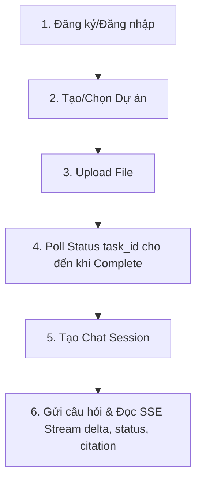

# Hướng dẫn Kết nối Frontend với RAGFlash Backend (Dành cho Coding Agent)

Tài liệu này cung cấp hướng dẫn chi tiết từng bước, cấu trúc dữ liệu và mã nguồn tham khảo để một **Coding Agent** (như VibeCode) có thể nhanh chóng xây dựng và kết nối giao diện Frontend với hệ thống Backend RAGFlash.

---

## 1. Thông tin chung về Backend

* **Địa chỉ chạy local**: `http://localhost:8000`
* **Tiền tố API**: `/api/v1`
* **Tài liệu Swagger (Interactive API)**: `http://localhost:8000/docs`
* **Xác thực**: Sử dụng **JWT (JSON Web Token)**. Tất cả các endpoint nghiệp vụ (ngoại trừ Auth) yêu cầu đính kèm header:
  ```http
  Authorization: Bearer <JWT_ACCESS_TOKEN>
  ```

---

## 2. Quy trình Nghiệp vụ (End-to-End Flow)

Giao diện người dùng sẽ chạy qua luồng nghiệp vụ chuẩn như sau:


---

## 3. Chi tiết API & Mã nguồn Tham khảo cho FE

### Bước 1: Xác thực (Authentication)

#### 1. Đăng nhập lấy Token
* **Endpoint**: `POST /api/v1/auth/login`
* **Body (JSON)**:
  ```json
  {
    "username": "user@example.com",
    "password": "securepassword"
  }
  ```
* **Phản hồi**:
  ```json
  {
    "access_token": "eyJhbGciOi...",
    "refresh_token": "eyJhbGciOi...",
    "token_type": "bearer"
  }
  ```
> [!IMPORTANT]
> FE cần lưu `access_token` vào bộ nhớ tạm (state) hoặc `localStorage` và tự động đính kèm vào header `Authorization: Bearer <token>` trong các cuộc gọi tiếp theo.

---

### Bước 2: Quản lý Dự án (Project)

Người dùng cần chọn một dự án để tải tài liệu và trò chuyện.

#### 1. Tạo dự án mới
* **Endpoint**: `POST /api/v1/projects/`
* **Body (JSON)**:
  ```json
  {
    "name": "Dự án Tìm kiếm Quy chế 2026",
    "description": "Chứa các tài liệu quy định nội bộ của công ty"
  }
  ```

#### 2. Lấy danh sách dự án
* **Endpoint**: `GET /api/v1/projects/`
* **Phản hồi**: Mảng danh sách các dự án chứa `id` (UUID).

---

### Bước 3: Tải Tài liệu & Theo dõi Tiến trình (Ingestion)

Tải tệp tin lên dự án. Quá trình chia nhỏ và nhúng vector diễn ra bất đồng bộ ở background, FE cần kiểm tra trạng thái tác vụ nền (polling).

#### 1. Upload File
* **Endpoint**: `POST /api/v1/ingestion/upload`
* **Content-Type**: `multipart/form-data`
* **Payload**:
  - `project_id`: `UUID` (ID của dự án đang chọn)
  - `file`: Tệp tin thực tế (PDF, TXT, DOCX)
  - `description`: Chuỗi mô tả (tùy chọn)
* **Mã tham khảo (JavaScript Fetch)**:
  ```javascript
  const formData = new FormData();
  formData.append('project_id', selectedProjectId);
  formData.append('file', fileInput.files[0]);
  
  const response = await fetch('http://localhost:8000/api/v1/ingestion/upload', {
    method: 'POST',
    headers: {
      'Authorization': `Bearer ${accessToken}`
    },
    body: formData
  });
  const result = await response.json();
  const taskId = result.data.task_id; // Lưu lại taskId để chạy bước 2
  ```

#### 2. Kiểm tra trạng thái xử lý (Polling Status)
* **Endpoint**: `GET /api/v1/ingestion/status/{task_id}`
* **Quy tắc FE**: Gọi API này mỗi **2 giây** cho đến khi trạng thái chuyển sang `"completed"` hoặc `"failed"`.
* **Phản hồi mẫu**:
  ```json
  {
    "success": true,
    "data": {
      "task_id": "uuid-cua-task",
      "status": "processing", // "pending", "processing", "completed", "failed"
      "progress": 50,
      "message": "Converting file to text..."
    }
  }
  ```

---

### Bước 4: Trò chuyện Hỏi đáp với AI (Chat & SSE)

#### 1. Tạo Phiên Chat mới (Chat Session)
Trước khi gửi câu hỏi, cần tạo hoặc chọn một phiên chat scoped theo dự án.
* **Endpoint**: `POST /api/v1/chat-sessions/`
* **Body (JSON)**:
  ```json
  {
    "project_id": "uuid-cua-du-an",
    "title": "Hỏi về Quy định Nghỉ phép"
  }
  ```

#### 2. Kết nối Luồng Câu trả lời Thời gian thực (Server-Sent Events)
* **Endpoint**: `POST /api/v1/chat/stream`
* **Body (JSON)**:
  ```json
  {
    "session_id": "uuid-phien-chat",
    "content": "Nhân viên thử việc có được nghỉ phép năm không?"
  }
  ```

#### Hướng dẫn Xử lý Sự kiện (SSE Stream Events) trên FE:

FE cần xử lý dòng dữ liệu gửi về qua các loại `event` sau:

| Tên Event | Kiểu dữ liệu nhận (`data`) | Ý nghĩa hành động trên UI |
| :--- | :--- | :--- |
| `message.created` | `{"message_id": "uuid"}` | Nhận ID tin nhắn AI mới. Khởi tạo bong bóng chat trống của AI. |
| `status` | `{"node": "planner", "status": "started"}` | Nhận bước chạy Agent. Hiển thị trạng thái động (VD: *"AI đang tìm kiếm tài liệu..."*). |
| `delta` | `{"content": "chữ..."}` | Nhận các ký tự sinh ra. Tiến hành nối text hiển thị hiệu ứng gõ chữ (typing). |
| `citation` | `{"id": "c1", "file_name": "HD.pdf", "page_number": 3}` | Nhận thông tin trích dẫn nguồn. Lưu vào danh sách trích dẫn của tin nhắn. |
| `message.done` | `{"content": "full markdown", "citations": [...]}` | Kết thúc stream. Render lại toàn bộ markdown hoàn thiện của câu trả lời kèm các nút nguồn trích dẫn. |
| `error` | `{"detail": "..."}` | Gặp lỗi. Hiển thị thông báo lỗi trên bong bóng chat của AI. |

#### Mã tham khảo nhận SSE Stream (React / Vanilla JS):
Vì endpoint là `POST`, chúng ta nên sử dụng thư viện `@microsoft/fetch-event-source` để dễ dàng gửi Body JSON kèm Header Auth:

```typescript
import { fetchEventSource } from '@microsoft/fetch-event-source';

async function sendChatMessage(sessionId: string, queryText: string) {
  let aiMessageText = '';
  let citations: any[] = [];
  let currentStatus = '';

  await fetchEventSource('http://localhost:8000/api/v1/chat/stream', {
    method: 'POST',
    headers: {
      'Content-Type': 'application/json',
      'Authorization': `Bearer ${accessToken}`
    },
    body: JSON.stringify({
      session_id: sessionId,
      content: queryText
    }),
    onmessage(ev) {
      const data = JSON.parse(ev.data);

      if (ev.event === 'message.created') {
        // Khởi tạo tin nhắn AI trên UI bằng data.message_id
      } else if (ev.event === 'status') {
        // Cập nhật dòng chữ trạng thái: "Đang chạy node: " + data.node
        currentStatus = data.node;
      } else if (ev.event === 'delta') {
        // Nối text live
        aiMessageText += data.content;
        updateChatUI(aiMessageText);
      } else if (ev.event === 'citation') {
        // Gom trích dẫn nguồn
        citations.push(data);
      } else if (ev.event === 'message.done') {
        // Hoàn thành! Render markdown và danh sách trích dẫn đầy đủ
        renderFinalAnswer(data.content, data.citations);
      }
    },
    onerror(err) {
      console.error('Stream error:', err);
      showChatError('Không thể hoàn thành câu trả lời.');
    }
  });
}
```

---

### Bước 5: Các Tác vụ Bổ trợ khác

#### 1. Hủy luồng sinh câu trả lời (Cancel Chat Stream)
* **Mục đích**: Khi AI đang viết chữ dài dòng, người dùng bấm nút "Stop" trên UI.
* **Endpoint**: `POST /api/v1/chat/stream/{run_id}/cancel`
* **Chi tiết**: `run_id` là mã phiên chạy (FE có thể bắt từ event khởi động ban đầu).

#### 2. Thumbs Up / Down (Feedback)
* **Mục đích**: Đánh giá câu trả lời của AI để lưu giữ số liệu phục vụ Langfuse.
* **Endpoint**: `POST /api/v1/chat-messages/{message_id}/feedback`
* **Body (JSON)**:
  ```json
  {
    "feedback": "thumb_up" // Hoặc "thumb_down"
  }
  ```

---

## 4. Bản đồ Trạng thái (Enums Mapping) & Lợi ích UI/UX

Để xây dựng một trải nghiệm người dùng (UX) mượt mà giống như NotebookLM, Coding Agent FE cần đặc biệt lưu ý cách map các **Enums Trạng thái** từ Backend lên giao diện:

### 4.1 Trạng thái Tải & Xử lý Tài liệu (Document Ingestion)

Khi gọi API check trạng thái `GET /api/v1/ingestion/status/{task_id}`, trường `status` sẽ lần lượt đi qua các giá trị sau. Hãy map chúng sang một danh sách tiến trình động (Progress Checklist) trên giao diện thay vì chỉ hiển thị một con quay xoay tròn (loading spinner) chung chung:

| Giá trị Enum của `status` | Ý nghĩa kỹ thuật | Trạng thái hiển thị gợi ý trên UI/UX |
| :--- | :--- | :--- |
| `pending` | Task đang nằm trong hàng đợi Celery | *Đang chờ xử lý trong hàng đợi...* |
| `checking_cache` | Check trùng lặp MD5/Semantic | *Đang kiểm tra dữ liệu cache...* |
| `parsing` | Chuyển đổi PDF/DOCX sang Markdown | *Đang trích xuất văn bản từ tệp tin...* (Hiển thị Progress: 15%) |
| `summarizing` | Gọi LLM tóm tắt toàn bộ tệp | *Đang phân tích và tóm tắt tài liệu...* (Hiển thị Progress: 50%) |
| `chunking` | Cắt nhỏ văn bản thành các đoạn | *Đang chia đoạn văn bản thông minh...* (Hiển thị Progress: 65%) |
| `enriching` | Bơm ngữ cảnh toàn cục vào từng chunk | *Đang tối ưu ngữ cảnh tìm kiếm...* (Hiển thị Progress: 80%) |
| `embedding` | Chuyển chữ thành Vector dense/sparse | *Đang nhúng vector toán học...* (Hiển thị Progress: 90%) |
| `saving` | Lưu dữ liệu vào Postgres và Qdrant | *Đang lưu trữ dữ liệu chỉ mục...* (Hiển thị Progress: 95%) |
| `completed` | Hoàn thành xuất sắc | *Đã xử lý xong! Sẵn sàng hỏi đáp.* (Hiển thị tick xanh lá cây 🟢) |
| `failed` | Gặp lỗi phần cứng/phần mềm | *Lỗi xử lý tệp tin. (Hiện nút Thử lại - Retry)* (Hiển thị dấu cảnh báo đỏ 🔴) |

---

### 4.2 Trạng thái Tin nhắn AI (Message Status & SSE Status)

Trong luồng nhắn tin, bạn cần hiển thị bong bóng chat sinh động tương ứng với trạng thái tin nhắn (`MessageStatus` và `status` event từ SSE):

* **Khi bấm gửi câu hỏi (`MessageStatus.PENDING`)**:
  - Bong bóng tin nhắn của AI được khởi tạo ở trạng thái trống.
  - Hiển thị hiệu ứng loading ba dấu chấm nhảy múa (Typing Indicator) và trạng thái: *"AI đang tiếp nhận câu hỏi..."*.
* **Khi nhận các sự kiện chạy node từ SSE (`status` event)**:
  - Hiển thị một bảng nhật ký Agent (Agent Logs) nhỏ, có thể bấm thu gọn/mở rộng dưới khung chat để người dùng theo dõi AI đang làm gì:
    * `node: "planner"` $\rightarrow$ *AI đang lập kế hoạch tìm kiếm thông tin...*
    * `node: "reasoner"` $\rightarrow$ *AI đang suy nghĩ và tổng hợp logic...*
    * `node: "executor"` $\rightarrow$ *AI đang chạy mã phân tích dữ liệu trong Sandbox...*
    * `node: "observer"` $\rightarrow$ *AI đang đánh giá độ tin cậy của tài liệu tìm được...*
    * `node: "finalizer"` $\rightarrow$ *AI đang soạn câu trả lời cuối cùng...*
* **Khi nhận text delta (`MessageStatus.STREAMING`)**:
  - Nối chuỗi chữ viết và cuộn màn hình chat xuống dưới tự động (Auto-scroll). 
  - Ẩn Typing Indicator và hiển thị chữ chạy thời gian thực.
* **Khi kết thúc tin nhắn (`MessageStatus.COMPLETED`)**:
  - Khóa nội dung, dừng cuộn.
  - Hiển thị các nút Like/Dislike (Feedback) và các trích dẫn tài liệu (Citations) dạng thẻ nhấp chuột ở chân tin nhắn để người dùng click mở xem đoạn trích gốc.
* **Khi bị lỗi hoặc hủy bỏ (`MessageStatus.FAILED`)**:
  - Hiển thị bong bóng chat màu đỏ nhạt, kèm thông tin lỗi (ví dụ: *"Yêu cầu bị hủy bỏ do mất kết nối"* hoặc *"Quá tải tài nguyên"*).
  - Hiển thị nút **"Thử lại" (Regenerate)**.

