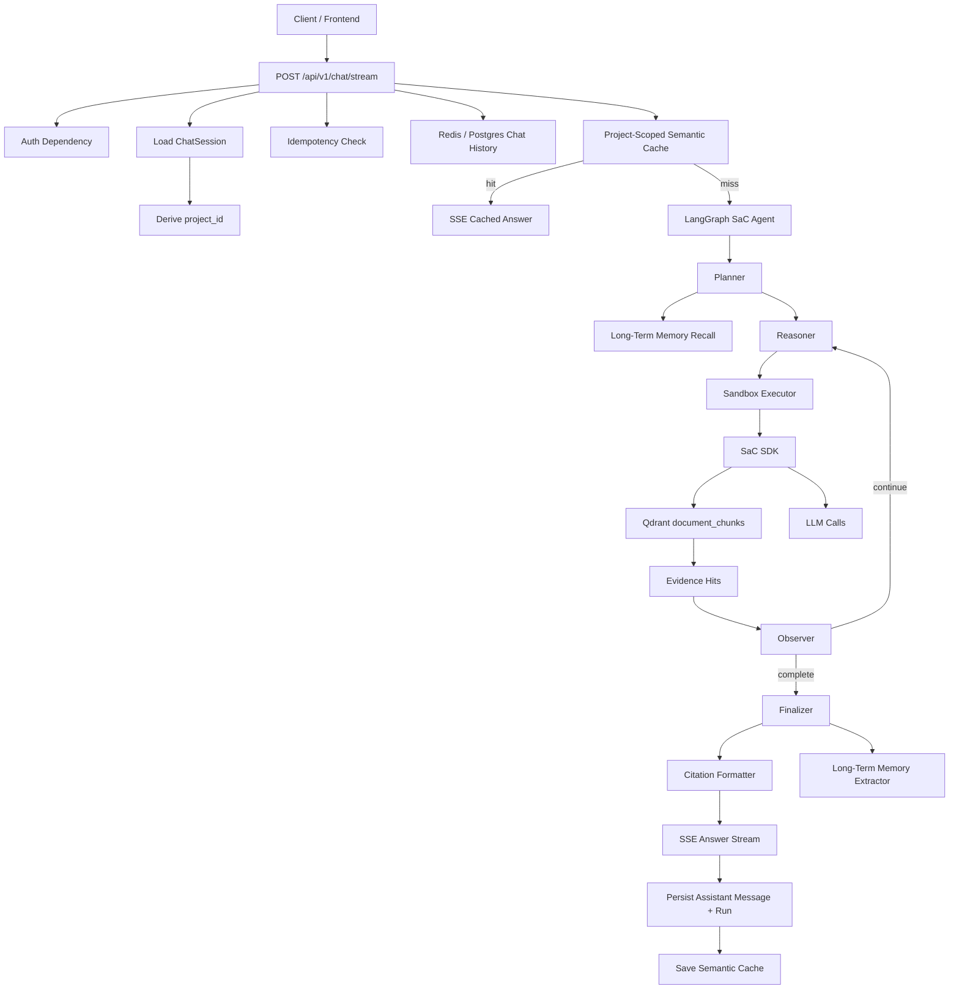

# RAGFlash NotebookLM Chat + Search-as-Code Integration Specification

Status: Draft for implementation  
Audience: Backend engineers, coding agents, product/architecture reviewers  
Scope: `backend` service only

---

## 1. Purpose

This specification defines the target backend architecture for a NotebookLM-style chatbot powered by Search-as-Code (SaC).

The product goal is:

> A user creates a project, uploads documents into that project, asks questions in a chat session scoped to that project, and receives streamed answers that are grounded in the uploaded sources, cite exact evidence, preserve useful memory, and expose enough traces/audit data for production operations.

This file is the integration contract between the existing backend modules:

- FastAPI chat streaming
- Project/document ingestion
- Qdrant vector retrieval
- Redis short-term chat history and semantic cache
- LangGraph SaC execution graph
- Long-term user memory
- Audit logging
- Observability and Langfuse tracing

It does not replace the lower-level SaC SDK spec. It clarifies how the SaC engine is used to implement the NotebookLM-style chat experience.

---

## 2. Product Requirements

### 2.1 User Experience

The chatbot must support:

1. Project-scoped document Q&A.
2. Multi-turn chat history inside a chat session.
3. Streaming answers over Server-Sent Events (SSE).
4. Source-grounded answers with citations.
5. Clear refusal/uncertainty when the project sources do not contain enough evidence.
6. Isolation between users and projects.
7. Durable chat messages and run metadata.
8. Cancellation of in-flight streams.
9. Long-term memory for user preferences and stable facts, not transient document facts.
10. Production-grade observability, audit logging, and regression evaluation.

### 2.2 Non-Goals

The initial production target does not require:

- Collaborative real-time document editing.
- Browser-based web search as a default answer source.
- Multi-modal answer generation beyond parsed document text.
- Fully isolated container sandbox per generated code execution, unless security hardening is explicitly scheduled.
- Frontend UI implementation.

---

## 3. Definitions

### 3.1 Project

A project is the primary data boundary for NotebookLM-style Q&A.

All document retrieval for a chat session must be scoped to the chat session's `project_id`.

### 3.2 Chat Session

A chat session belongs to exactly one user and one project.

The request payload for `/chat/stream` must not be trusted to provide `project_id`; the backend must derive `project_id` from `ChatSession.project_id`.

### 3.3 SaC

Search-as-Code is the agent execution pattern where a model writes Python code using a controlled SDK, the backend validates and executes that code in a sandbox, and the graph loops until enough evidence is collected.

### 3.4 Citation

A citation is a structured reference to retrieved evidence. It must identify the source document and, when available, page number and chunk index.

### 3.5 Short-Term Memory

Short-term memory is recent chat history for the current session. It is cached in Redis and can be loaded from Postgres on cache miss.

### 3.6 Long-Term Memory

Long-term memory is durable user-specific memory used across sessions. It must store only stable user preferences or durable facts, not temporary search results or project source content.

---

## 4. Production Readiness Target

The intended "80% production" target means:

1. Core happy path works end to end.
2. Project/user isolation has automated tests.
3. Streaming preserves durability, idempotency, cancellation, and failure states.
4. Answers are source-grounded and cite retrievable evidence.
5. The graph has explicit completion and finalization semantics.
6. Observability captures graph nodes, SDK calls, retrieval, citations, token/cost, and failures.
7. Audit events are persisted for security/compliance write operations.
8. Migrations exist for new database objects.
9. Regression tests cover retrieval, graph, chat streaming, memory, citation, and cache scope.

It does not imply full enterprise hardening, formal SLOs, or a hardened remote code execution environment. Those are later production-hardening milestones.

---

## 5. High-Level Architecture



---

## 6. Core Invariants

### 6.1 Project Isolation

Every document retrieval path must enforce `project_id`.

Required enforcement points:

1. Chat session lookup.
2. Initial LangGraph state.
3. Sandbox environment.
4. SDK retrieval.
5. Qdrant query filter.
6. Semantic cache key/filter.
7. Evaluation tests.

If `project_id` is missing, document retrieval from project sources must fail closed.

### 6.2 User Isolation

User-specific data must be scoped by `user_id`.

Required enforcement points:

1. Chat session ownership.
2. Long-term memory recall/save.
3. Chat stream idempotency keys.
4. Audit log `user_id`.
5. Semantic cache scope when cache contains personalized answers.

### 6.3 Evidence-Grounded Answering

The assistant must not claim source-backed facts unless they are present in retrieved project evidence.

If evidence is insufficient, the assistant must say that the uploaded sources do not contain enough information.

### 6.4 Citation Integrity

Every citation in the final answer must be traceable to a retrieved `SearchHit`.

The finalizer must not invent document names, pages, URLs, or chunk IDs.

### 6.5 Streaming Durability

For every non-cache stream:

1. A user message is persisted before generation.
2. An assistant placeholder message is persisted before generation.
3. A stream run is persisted with `streaming` status.
4. Final content is persisted on success.
5. Partial content and failure state are persisted on error/cancel/disconnect.
6. Redis chat history cache is invalidated after outcome update.

### 6.6 Audit Logging

Security/compliance write operations must write durable audit rows. Diagnostic logs are not a substitute.

### 6.7 Observability

Every graph run must be traceable by:

- `run_id`
- `thread_id`
- `session_id`
- `project_id`
- `user_id`
- `message_id`

---

## 7. Current Repo Mapping

The current backend already contains these useful foundations:

| Capability | Current location | Notes |
|---|---|---|
| Chat streaming API | `app/api/controllers/chat.py` | Existing `/chat/stream` endpoint |
| Chat stream orchestration | `app/services/chat/stream.py` | Idempotency, rate limits, semantic cache, provider streaming |
| Chat sessions | `app/models/chat_session.py` | Contains `user_id` and `project_id` |
| Chat messages | `app/models/chat_message.py` | Durable message history |
| Redis chat history | `app/services/core/redis_service.py` | Session-scoped STM |
| Semantic cache | `app/services/chat/semantic_cache.py` | Needs project/user scoping |
| Ingestion | `app/services/core/ingestion.py` | Creates document and ingestion task |
| Ingestion worker | `app/tasks/ingestion_tasks.py` | Runs async pipeline |
| Qdrant manager | `app/core/qdrant.py` | Needs `query_filter` support |
| Qdrant payload | `app/rag/ingestion/handlers/embed_handler.py` | Has `project_id`; needs richer source metadata |
| SaC SDK retrieval | `app/sdk/low_level/retrieval.py` | Needs project filter from environment/state |
| LangGraph graph | `app/graph/builders/graph_builder.py` | Needs observer/finalizer path |
| Planner | `app/graph/nodes/planner.py` | Initializes prompt/state and recalls LTM |
| Reasoner | `app/graph/nodes/reasoner.py` | Generates Python code |
| Executor | `app/graph/nodes/executor.py` | Runs sandbox |
| Memory service | `app/services/agent/memory_service.py` | User-scoped LTM |
| Architecture rules | `PROJECT_ARCHITECTURE.md` | Logging/audit requirements |

---

## 8. Target Chat Flow

### 8.1 Request

Endpoint:

```http
POST /api/v1/chat/stream
```

Request body:

```json
{
  "session_id": "uuid",
  "message": "string",
  "parent_id": "uuid | null",
  "client_request_id": "string | null"
}
```

The request must not contain `project_id`. The backend derives it from the session.

### 8.2 Preparation

`ChatStreamService.prepare_stream()` must:

1. Trim and validate message content.
2. Resolve idempotent replay by `(user_id, client_request_id)`.
3. Enforce rate/concurrency limits.
4. Load `ChatSession` and verify ownership.
5. Derive `project_id` from `ChatSession.project_id`.
6. Create user message and assistant placeholder.
7. Create `ChatStreamRun`.
8. Load recent history from Redis/Postgres.
9. Check project-scoped semantic cache.
10. **Perform Fast-Path Out-of-Scope check**: Determine if the user's intent is completely unrelated to the project's documents.
    - Query document metadata (filenames) for the current project.
    - Call a fast classifier/router (e.g., using a cheap/fast LLM call).
    - If out-of-scope, return a prepared replay payload containing the proactive refusal response and file list directly, bypassing LangGraph completely to save latency and cost.
11. Return a prepared object containing all immutable run context.

### 8.3 Prepared Chat Stream Contract

`PreparedChatStream` must include:

```python
@dataclass(frozen=True)
class PreparedChatStream:
    run_id: uuid.UUID
    user_id: uuid.UUID
    project_id: uuid.UUID
    session_id: uuid.UUID
    user_message_id: uuid.UUID | None
    assistant_message_id: uuid.UUID | None
    messages: list[dict[str, str]]
    client_request_id: str | None = None
    replay_content: str | None = None
    replay_prompt_tokens: int = 0
    replay_completion_tokens: int = 0
    query_hash: str | None = None
```

### 8.4 Generation

If semantic cache hits:

1. Return cached answer as SSE.
2. Preserve current replay behavior.
3. Persist completed messages/run.

If semantic cache misses:

1. Build LangGraph initial state.
2. Call `agent_graph.astream_events(..., version="v2")`.
3. Translate graph events to chat SSE events.
4. Persist outcome.
5. Save semantic cache asynchronously if eligible.
6. Trigger memory extraction after finalization.

---

## 9. LangGraph Target Architecture

### 9.1 Required Nodes

The graph must use this logical flow:

```text
planner -> reasoner -> executor -> observer -> (reasoner | finalizer) -> memory_extractor -> END
```

Node responsibilities:

| Node | Responsibility |
|---|---|
| `planner` | Initialize task state, system prompt, state dir, STM context, LTM recall, project/user context |
| `reasoner` | Generate next Python code action from compact working memory |
| `executor` | Validate and execute code in sandbox |
| `observer` | Read completion signal, scores, evidence files, errors; decide continue vs finish |
| `finalizer` | Load final evidence/results, produce answer and citations |
| `memory_extractor` | Extract durable user memories only after answer generation |

The existing `extractor` node should be renamed or treated as `memory_extractor`. It must not be the final answer node.

### 9.2 Graph Edges

```python
graph.add_edge(START, "planner")
graph.add_edge("planner", "reasoner")
graph.add_edge("reasoner", "executor")
graph.add_edge("executor", "observer")
graph.add_conditional_edges(
    "observer",
    should_continue,
    {
        "reasoner": "reasoner",
        "finalizer": "finalizer",
    },
)
graph.add_edge("finalizer", "memory_extractor")
graph.add_edge("memory_extractor", END)
```

### 9.3 Stop Conditions

`observer` must stop when any of these is true:

1. `coverage_score >= 0.90` and `confidence_score >= 0.80`.
2. `is_complete == True`.
3. `current_turn >= max_turns`.
4. Three consecutive execution failures.
5. Client cancellation signal is detected.

### 9.4 Completion Signal

The model-generated code can write:

```json
{
  "coverage_score": 0.95,
  "confidence_score": 0.88,
  "reason": "Enough project evidence found",
  "final_results_file": "final_results.json"
}
```

Path:

```text
STATE_DIR/completion_signal.json
```

### 9.5 Final Results File

The model-generated code should write:

```json
{
  "answer_notes": [
    {
      "claim": "string",
      "evidence_ids": ["hit-id-1", "hit-id-2"],
      "confidence": 0.9
    }
  ],
  "evidence": [
    {
      "id": "hit-id-1",
      "title": "Document title",
      "content": "Relevant snippet",
      "url": "file://...",
      "score": 0.82,
      "metadata": {
        "document_id": "uuid",
        "project_id": "uuid",
        "chunk_index": 12,
        "page_number": 3,
        "file_name": "source.pdf"
      }
    }
  ]
}
```

Path:

```text
STATE_DIR/final_results.json
```

The finalizer may also use `turns`, `state_files`, and `last_coverage_summary`, but final citations must come from the `evidence` array.

---

## 10. Agent State Contract

`AgentState` must include:

```python
class AgentState(TypedDict):
    task_id: str
    run_id: str
    session_id: str
    user_message_id: str
    assistant_message_id: str

    user_id: str
    project_id: str

    directive: str
    domain_context: str | None
    constraints: list[str]

    messages: Annotated[list[BaseMessage], add_messages]
    recent_chat_history: list[dict[str, str]]
    recalled_memories: list[str]

    turns: Annotated[list[TurnRecord], operator.add]
    current_turn: int
    max_turns: int

    state_dir: str
    state_files: list[str]

    turn_summaries: list[TurnSummary]
    last_coverage_summary: str | None
    last_error: str | None

    coverage_score: float
    confidence_score: float
    is_complete: bool
    stop_reason: str | None

    evidence: list[dict]
    final_answer: str | None
    citations: list[dict]
    results: list[dict] | None

    total_sdk_calls: int
    total_tokens: int
    cost_usd: float

    cancelled: bool
    _pending_code: str | None
```

### 10.1 Required Initial State

The chat service must create:

```python
initial_state = {
    "task_id": str(prepared.run_id),
    "run_id": str(prepared.run_id),
    "session_id": str(prepared.session_id),
    "user_message_id": str(prepared.user_message_id),
    "assistant_message_id": str(prepared.assistant_message_id),
    "user_id": str(prepared.user_id),
    "project_id": str(prepared.project_id),
    "directive": payload.message.strip(),
    "domain_context": None,
    "constraints": [
        "Answer only from evidence found in this project unless explicitly told otherwise.",
        "If the uploaded sources do not contain enough evidence, say so clearly.",
        "Every factual source-backed claim must include citations."
    ],
    "messages": langchain_messages,
    "recent_chat_history": recent_history_dicts,
    "recalled_memories": [],
    "turns": [],
    "current_turn": 0,
    "max_turns": settings.CHAT_SAC_MAX_TURNS,
    "state_dir": "",
    "state_files": [],
    "turn_summaries": [],
    "last_coverage_summary": None,
    "last_error": None,
    "coverage_score": 0.0,
    "confidence_score": 0.0,
    "is_complete": False,
    "stop_reason": None,
    "evidence": [],
    "final_answer": None,
    "citations": [],
    "results": None,
    "total_sdk_calls": 0,
    "total_tokens": 0,
    "cost_usd": 0.0,
    "cancelled": False,
    "_pending_code": None,
}
```

---

## 11. Project-Scoped Retrieval

### 11.1 Qdrant Manager

`QdrantManager.search_vectors()` must accept an optional Qdrant filter:

```python
def search_vectors(
    self,
    collection_name: str,
    query_vector: list[float],
    limit: int = 10,
    score_threshold: float = 0.5,
    query_filter: Filter | None = None,
) -> list[dict]:
    results = self.client.search(
        collection_name=collection_name,
        query_vector=query_vector,
        limit=limit,
        score_threshold=score_threshold,
        query_filter=query_filter,
    )
```

### 11.2 Sandbox Environment

`SandboxExecutor` must receive `project_id`:

```python
SandboxExecutor(
    task_id=state["task_id"],
    state_dir=state_dir,
    project_id=state["project_id"],
)
```

The subprocess environment must include:

```text
PROJECT_ID=<project uuid>
USER_ID=<user uuid>
SESSION_ID=<session uuid>
RUN_ID=<run uuid>
```

If `PROJECT_ID` is absent during document retrieval, `sdk.retrieve(..., source="index")` must return no project document hits or raise a controlled error.

### 11.3 SDK Retrieval

For `source in {"index", "embedding_store"}`, `retrieve()` must:

1. Read `PROJECT_ID`.
2. Build Qdrant filter:

```python
Filter(
    must=[
        FieldCondition(
            key="project_id",
            match=MatchValue(value=project_id),
        )
    ]
)
```

3. Pass the filter to `qdrant_manager.search_vectors()`.
4. Include citation metadata in `SearchHit.metadata`.

### 11.4 Retrieval Result Metadata

Each document `SearchHit` must include:

```json
{
  "id": "embedding-or-chunk-id",
  "title": "source file name or document title",
  "content": "chunk content",
  "url": "file://document/<document_id>#chunk=<chunk_index>",
  "score": 0.87,
  "metadata": {
    "document_id": "uuid",
    "project_id": "uuid",
    "chunk_index": 12,
    "page_number": 3,
    "file_name": "source.pdf",
    "mime_type": "application/pdf"
  }
}
```

---

## 12. Ingestion Metadata Requirements

The ingestion pipeline must write enough metadata for citations.

### 12.1 Qdrant Payload

Required payload fields:

```json
{
  "document_id": "uuid",
  "project_id": "uuid",
  "chunk_id": "uuid",
  "chunk_index": 0,
  "content": "string",
  "title": "string",
  "file_name": "source.pdf",
  "page_number": 1,
  "mime_type": "application/pdf",
  "source_uri": "file://document/<document_id>#page=1&chunk=0"
}
```

### 12.2 DocumentChunk

`DocumentChunk` already has `page_number`, `chunk_index`, and `meta_data`. The pipeline should ensure those fields are populated when parser output supports them.

### 12.3 Source URI

The backend should use internal source URIs, not raw local filesystem paths:

```text
ragflash://projects/<project_id>/documents/<document_id>/chunks/<chunk_id>
```

The frontend or download API can resolve these URIs later.

---

## 13. Citation Contract

### 13.1 Citation Object

The finalizer must output citations as structured data:

```json
{
  "id": "c1",
  "document_id": "uuid",
  "chunk_id": "uuid | null",
  "file_name": "source.pdf",
  "title": "source.pdf",
  "page_number": 3,
  "chunk_index": 12,
  "source_uri": "ragflash://projects/.../documents/.../chunks/...",
  "quote": "short evidence quote",
  "score": 0.87
}
```

### 13.2 Answer Format

The final answer should be Markdown:

```markdown
The answer grounded in the user's uploaded sources. [1]

If another claim uses a different chunk, cite it separately. [2]

Sources:
[1] source.pdf, page 3
[2] policy.md, chunk 8
```

### 13.3 Citation Rules

1. Every source-backed factual paragraph must have at least one citation.
2. Citations must reference only retrieved evidence.
3. Citation IDs must be stable within one answer.
4. Quotes must be short snippets, not full pages.
5. If page number is unavailable, cite chunk index.
6. If no evidence is found, return an insufficient-evidence answer with no fabricated sources.

### 13.4 Insufficient Evidence and Out-of-Scope Refusal Format

When the query is out-of-scope (chatted early/chatted out of project bounds) or when no evidence is found in the final results, the response must display the available files to guide the user:

```markdown
I could not find enough information in the uploaded sources for this project to answer that confidently.

The documents currently uploaded in this project are:
- {file_name_1}
- {file_name_2}

Please ask questions related to the content of these documents.

What was checked:
- Relevant project document chunks
- Recent chat context
```

---

## 14. Prompt Contracts

### 14.1 Planner System Prompt Must Include

The planner prompt must instruct the reasoner:

1. Use `sdk.retrieve(..., source="index")` for project documents.
2. Preserve `SearchHit.metadata` through all intermediate files.
3. Write `final_results.json` with evidence IDs and metadata.
4. Write `completion_signal.json` only when enough grounded evidence exists.
5. Never answer from memory alone when the question asks about project documents.
6. Use LTM only for user preferences and stable personalization.

### 14.2 Reasoner Prompt Must Include

The reasoner prompt must receive compact working memory:

- Original user question
- Project scope
- Recent chat summaries
- Current evidence summary
- Previous turn summaries
- Available state files
- Last error
- Citation requirements

It must not receive full raw message history after the planner step.

### 14.3 Finalizer Prompt Must Include

The finalizer prompt must:

1. Receive `final_results.json` evidence.
2. Produce `final_answer`.
3. Produce `citations`.
4. Refuse unsupported claims.
5. Distinguish source evidence from recalled user memory.

---

## 15. Semantic Cache

### 15.1 Cache Scope

Semantic cache must be scoped.

Minimum cache key scope:

```text
semantic_cache:{project_id}:{query_hash}
semantic_lock:{project_id}:{query_hash}
```

If answer generation uses user-specific LTM, include `user_id` in the scope:

```text
semantic_cache:{project_id}:{user_id}:{query_hash}
```

### 15.2 Qdrant Semantic Cache Payload

The semantic cache vector payload must include:

```json
{
  "project_id": "uuid",
  "user_id": "uuid | null",
  "query": "string",
  "redis_key": "semantic_cache:...",
  "source_document_ids": ["uuid"],
  "model_name": "string"
}
```

### 15.3 Cache Eligibility

Do not save a semantic cache entry when:

1. The stream failed, was cancelled, or disconnected.
2. The answer includes user-private LTM and cache is not user-scoped.
3. The answer has no citations but claims source-backed facts.
4. The project has changed since the cache entry was created and invalidation is not implemented.

### 15.4 Invalidation

On document upload/delete/re-embed for a project:

1. Invalidate chat history for affected sessions if needed.
2. Invalidate or version semantic cache entries for that project.

Recommended approach:

```text
project_corpus_version:{project_id}
```

Include corpus version in the semantic cache payload/key.

---

## 16. Memory Contract

### 16.1 Short-Term Memory

STM source:

1. Redis cached chat history.
2. Postgres fallback from `chat_messages`.

STM must be:

- Session-scoped.
- Used for conversation continuity.
- Converted into LangChain `HumanMessage` and `AIMessage` where needed.
- Trimmed by budget.

### 16.2 Long-Term Memory Recall

LTM recall must be:

- User-scoped.
- Limited by top-k and token budget.
- Clearly marked as user memory, not document evidence.

### 16.3 Long-Term Memory Extraction

Memory extraction must run after finalization.

It may save:

- User preferences.
- Durable workflow preferences.
- Stable user facts.

It must not save:

- Project document content.
- Temporary answer facts.
- Retrieval results.
- Citations.
- Credentials, tokens, or secrets.

---

## 17. Streaming SSE Contract

### 17.1 Event Types

The chat stream should preserve current client-compatible events:

| Event | Meaning |
|---|---|
| `message.created` | Assistant placeholder exists |
| `status` | Graph/node status update |
| `delta` | Answer text chunk |
| `citation` | Optional citation object emitted before/during final answer |
| `message.done` | Final answer complete |
| `error` | Stream failed/cancelled/disconnected |

### 17.2 Example Stream

```text
event: message.created
data: {"message_id":"..."}

event: status
data: {"node":"planner","status":"started"}

event: status
data: {"node":"executor","status":"started","turn":1}

event: delta
data: {"message_id":"...","content":"The document states..."}

event: citation
data: {"id":"c1","file_name":"source.pdf","page_number":3}

event: message.done
data: {"message_id":"...","content":"final markdown","citations":[...]}
```

### 17.3 LangGraph Event Mapping

Map `agent_graph.astream_events()` to SSE:

| LangGraph event | SSE event |
|---|---|
| `on_chain_start` for node | `status` |
| `on_chain_end` for `executor` | `status` turn complete |
| `on_chain_end` for `observer` | `status` scores |
| `on_chain_stream` from finalizer LLM | `delta` |
| final graph output | `message.done` |
| exception | `error` |

### 17.4 Cancellation

Cancellation must be checked:

1. Before graph start.
2. Between graph events.
3. Before each sandbox execution.
4. During provider/finalizer streaming where supported.

Cancelled streams must be marked failed or cancelled consistently in `chat_stream_runs`.

---

## 18. Audit Logging

### 18.1 Audit Model

Add `AuditLog`:

```python
class AuditLog(AuditLogMixin, Base):
    __tablename__ = "audit_logs"

    user_id: Mapped[uuid.UUID | None]
    project_id: Mapped[uuid.UUID | None]
    action: Mapped[str]
    status: Mapped[str]
    ip_address: Mapped[str | None]
    user_agent: Mapped[str | None]
    context: Mapped[dict]
```

Recommended indexes:

- `(user_id, created_at)`
- `(project_id, created_at)`
- `(action, created_at)`
- `(status, created_at)`

### 18.2 Helper

Add:

```python
def log_audit_event(
    uow: UnitOfWork,
    *,
    user_id: uuid.UUID | None,
    project_id: uuid.UUID | None,
    action: str,
    status: str,
    context: dict | None = None,
    ip_address: str | None = None,
    user_agent: str | None = None,
) -> AuditLog:
    ...
```

### 18.3 Required Events

| Action | Trigger |
|---|---|
| `document.upload` | Upload accepted |
| `document.upload_failed` | Upload rejected/failed |
| `document.delete` | Soft/hard delete |
| `api_key.create` | API key created |
| `api_key.revoke` | API key revoked |
| `virus.quarantine` | File quarantined |
| `chat.cancel` | Stream cancelled |

### 18.4 Sensitive Data Rule

Never store:

- Raw passwords.
- Raw refresh/access tokens.
- Full API keys.
- Full uploaded file content.
- Full chat contents unless explicitly approved.

---

## 19. Observability and Langfuse

### 19.1 Trace Identity

Every chat graph run must create or attach to one trace with:

```json
{
  "trace_id": "run_id or langfuse trace id",
  "run_id": "uuid",
  "thread_id": "uuid",
  "session_id": "uuid",
  "project_id": "uuid",
  "user_id": "uuid",
  "assistant_message_id": "uuid"
}
```

### 19.2 Span Taxonomy

Required spans:

| Span | Attributes |
|---|---|
| `chat.prepare` | session/project/user, idempotency/cache status |
| `graph.run` | thread_id, max_turns, stop_reason |
| `graph.node.planner` | prompt size, memory count |
| `graph.node.reasoner` | model, input/output tokens, generated code length |
| `graph.node.executor` | turn, returncode, duration, validation status |
| `sdk.retrieve` | source, project_id, limit, result_count, latency |
| `sdk.llm.extract_many` | item_count, model, latency, token/cost |
| `graph.node.observer` | coverage_score, confidence_score, continue/stop |
| `graph.node.finalizer` | citation_count, final_answer_length, token/cost |
| `memory.recall` | user_id, count, latency |
| `memory.extract` | saved_count, skipped_count |
| `chat.persist_outcome` | status, duration_ms |

### 19.3 Langfuse Integration Points

Langfuse should wrap:

1. Chat stream run.
2. Each graph node.
3. Each LLM call.
4. Each SDK operation.
5. Final answer/citation output.

### 19.4 Redaction

Before sending to Langfuse:

- Mask secrets.
- Truncate large chunks.
- Store source snippets under configured limits.
- Do not send full uploaded documents.

### 19.5 Metrics

Expose Prometheus metrics:

- Chat stream count by status.
- Graph run latency.
- Node latency.
- Retrieval latency/result count.
- Citation count.
- Insufficient-evidence rate.
- Cross-project leak test failures.
- Token/cost counters.
- Sandbox validation failures.
- Audit write failures.

---

## 20. Guardrails and Security Requirements

To ensure safety, privacy, and compliance during LangGraph and Search-as-Code (SaC) execution, the system must enforce four layers of guardrails.

### 20.1 Execution Guardrails (AST & Sandbox)

The backend must intercept and validate model-generated Python code before spawning any subprocess.

1. **AST Validation**: Scan the Abstract Syntax Tree (AST) using `ASTValidator` before writing code to disk. Reject code containing syntax errors or unsafe operations immediately.
2. **Blocked Calls**: Actively block calls to `exec()`, `eval()`, `compile()`, `__import__()`, and bare `open()` (filesystem access must go through `STATE_DIR`).
3. **Subprocess Isolation**: Execute validated code via `SandboxExecutor` in a dedicated subprocess with strict limits:
   - Hard timeout enforced (e.g., maximum 60-120 seconds).
   - Minimal environment variables (`PROJECT_ID`, `USER_ID`, `SESSION_ID`, `RUN_ID`, `PYTHONPATH`, `STATE_DIR`).
   - Blocked imports for system command libraries (e.g., `os`, `sys`, `subprocess`, `shutil` must be blocked except for allowed prefixes).
4. **Allowlist Imports**: Only allow imports from standard safe libraries (`json`, `re`, `math`, `datetime`, `collections`, `itertools`, `functools`, `pathlib`, `typing`, `asyncio`) and the official SDK (`app.sdk`).
   - *Import Bug Fix*: The AST validator must support prefix checking to allow `from app.sdk import sdk` while preventing broad unsafe imports.
5. **Sandbox Hardening Target**: Host subprocess is acceptable for MVP, but production hardening must move generated code execution to a stronger isolation boundary (e.g., gVisor, Docker, or Firecracker microVMs).

### 20.2 Data Isolation Guardrails (Access Scoping)

Prevent cross-project or cross-user data leakage at the query boundary:

1. **Fail-Closed Retrieval**: Project document retrieval must fail closed and return empty hits or raise a controlled exception if `PROJECT_ID` is absent or malformed in the execution context.
2. **Scoped Vector Search**: Every search on the vector store (`QdrantManager.search_vectors`) must force a strict metadata filter matching the current `project_id`.
3. **Semantic Cache Isolation**: Cache keys must include the project identifier (and user identifier if personalized LTM is used) to prevent cache poisoning across projects.

### 20.3 Privacy Guardrails (Redaction & PII)

Ensure that logs, debug traces, and telemetry do not leak sensitive information:

1. **OTel/Langfuse Redaction**: Scrub raw API keys, session tokens, passwords, and raw document contents before exporting metrics or traces.
2. **Trace Masking**: Limit exported source document snippets to configurable maximum character lengths.

### 20.4 Output Alignment Guardrails (Grounded Refusals & Citations)

Avoid hallucinated responses and ensure citation compliance:

1. **Evidence-Grounded Refusal**: If the evidence collected in `final_results.json` is empty or insufficient, the assistant must trigger the standard proactive refusal message rather than trying to answer from the model's parametric memory.
2. **Standard Refusal Format**: Refusal responses must follow a structured, non-hallucinated layout stating clearly that the source documents do not contain enough information, along with a list of the checked sources.
3. **Citation Authenticity Check**: Before completing the response, the system must run a deterministic checker ensuring that every citation `[N]`'s quote/content text matches the actual text of one of the retrieved `SearchHits` in `final_results.json`.
   - If a citation is fabricated (source text does not match the actual retrieved text), the citation must be removed or the claim flagged/stripped to avoid citation hallucination.

### 20.5 Input & Intent Guardrails (Fail-Fast Router & Budgets)

To avoid high token costs and several seconds of execution latency for out-of-scope questions, the system must filter inputs before spawning the LangGraph:

1. **Fast Classifier & Fail-Open Routing**: Run a lightweight classifier LLM or semantic similarity router on the incoming message during the stream preparation phase.
   - If the router is highly confident that the query is out-of-scope (e.g., confidence > 0.95), trigger the short-circuit path.
   - If the query is borderline or classification is uncertain, fail-open and let the query proceed into the LangGraph to ensure no valid document-based questions are blocked.
2. **Prompt Injection & Toxicity Defense**: Check incoming queries using lightweight security patterns (regex or OpenAI Moderation API) to detect prompt injections or harmful content. Short-circuit unsafe inputs immediately with a standardized refusal response.
3. **Token & Cost Budgeting**: Prevent financial draining from runaway recursive agent loops by enforcing hard limits per session/user:
   - **Graph Hard Stop**: Auto-terminate the LangGraph loop if cumulative tokens or accumulated cost exceeds a configured safe threshold per query (e.g., maximum $0.50 per query, or 100k tokens total).
   - **User Daily Limit**: Block chat requests if the user exceeds their daily API cost budget.
4. **Budget Limit**: The routing LLM call must use a low-latency model (e.g., `gpt-4o-mini` or equivalent fast model) and strict token/temperature settings to execute under 500ms.

---

## 21. Database and Migration Requirements

Required schema changes:

1. `audit_logs` table.
2. Optional `project_corpus_version` field/table for semantic cache invalidation.
3. Optional `chat_stream_runs.project_id` for faster filtering/debugging.
4. Optional citation metadata storage if citations need first-class querying.

### 21.1 Citation Persistence Option

If citations need durable querying, add:

```sql
CREATE TABLE chat_message_citations (
    id UUID PRIMARY KEY DEFAULT gen_random_uuid(),
    message_id UUID REFERENCES chat_messages(id) ON DELETE CASCADE,
    document_id UUID REFERENCES documents(id) ON DELETE SET NULL,
    chunk_id UUID REFERENCES document_chunks(id) ON DELETE SET NULL,
    citation_index INTEGER NOT NULL,
    file_name TEXT,
    page_number INTEGER,
    chunk_index INTEGER,
    source_uri TEXT,
    quote TEXT,
    score NUMERIC,
    created_at TIMESTAMPTZ DEFAULT NOW()
);
```

For MVP, citations can be stored in `chat_messages.metadata_["citations"]`.

---

## 22. Configuration

Add settings:

```python
CHAT_SAC_ENABLED: bool = True
CHAT_SAC_MAX_TURNS: int = 6
CHAT_SAC_RETRIEVAL_LIMIT: int = 8
CHAT_SAC_MIN_COVERAGE_SCORE: float = 0.90
CHAT_SAC_MIN_CONFIDENCE_SCORE: float = 0.80
CHAT_SAC_REQUIRE_CITATIONS: bool = True

SEMANTIC_CACHE_SCOPE: str = "project"  # "project" | "project_user" | "disabled"
SEMANTIC_CACHE_INCLUDE_CORPUS_VERSION: bool = True

LANGFUSE_ENABLED: bool = False
LANGFUSE_PUBLIC_KEY: str | None = None
LANGFUSE_SECRET_KEY: str | None = None
LANGFUSE_HOST: str | None = None
TRACE_SOURCE_SNIPPET_MAX_CHARS: int = 1000
```

---

## 23. Test Requirements

### 23.1 Unit Tests

Required:

1. `QdrantManager.search_vectors()` passes `query_filter`.
2. `sdk.retrieve()` builds project filter from `PROJECT_ID`.
3. `SandboxExecutor` injects `PROJECT_ID`.
4. AST validator allows `from app.sdk import sdk`.
5. Semantic cache key includes `project_id`.
6. Citation formatter rejects missing evidence IDs.
7. Memory extractor does not save source facts.
8. Audit helper writes a row and masks sensitive context.

### 23.2 Integration Tests

Required:

1. Upload document into Project A, ask in Project A, answer cites Project A.
2. Ask same question in Project B, answer does not cite Project A.
3. Same query text in two projects does not share semantic cache answer.
4. Stream cancellation marks run and message correctly.
5. Graph produces final answer through finalizer.
6. Insufficient evidence produces refusal answer.
7. Redis chat history is loaded into initial state.
8. LTM recall is scoped by `user_id`.

### 23.3 Regression/Evaluation Dataset

Maintain a small local dataset:

```text
tests/fixtures/notebooklm/
  project_a/
    handbook.pdf.txt
    policy.md
    questions.jsonl
  project_b/
    unrelated.md
    questions.jsonl
```

Each question should specify:

```json
{
  "question": "string",
  "expected_answer_contains": ["string"],
  "expected_citations": [{"file_name": "policy.md", "page_number": 2}],
  "must_not_contain": ["string from other project"]
}
```

### 23.4 Evaluation Metrics

Track and calculate the following metrics:

1. **Answer Groundedness**: Verify that all factual claims in the generated answer are fully supported by the retrieved evidence chunks.
2. **Citation Precision**: Ensure all citations present in the answer actually map to correct, existing chunks and documents retrieved during that session.
3. **Citation Recall**: Measure if all essential evidence used to formulate the answer is correctly cited.
4. **Cross-Project Leakage**: Verify that querying in Project A never retrieves chunks, filenames, or content from documents belonging to Project B.
5. **Insufficient-Evidence Correctness**: Ensure the assistant outputs the standard refusal message when the test query cannot be answered using the project documents.
6. **Performance & Cost**: Trace p50/p95 latency, prompt/completion tokens, and total cost USD per run.

### 23.5 Evaluation Strategy

To implement these metrics without introducing heavy ML dependencies to the core API runtime, a hybrid evaluation pipeline must be used:

1. **Deterministic Test Harness (Custom pytest suite)**:
   - Create a dedicated script (`tests/eval_runner.py`) using `pytest` to parse local `questions.jsonl` files.
   - Assert exact string matches (`expected_answer_contains`) and anti-patterns (`must_not_contain` for leakage checks).
   - Parse and validate citation links to ensure they match the local document schemas.
2. **LLM-as-a-Judge (Custom Evaluator)**:
   - For complex, non-deterministic metrics like *Groundedness* and *Insufficient-Evidence Correctness*, use a lightweight LLM judge call.
   - The judge reads the generated response, the original user question, and the retrieved chunks from `final_results.json`, then scores groundedness from 0.0 to 1.0.
3. **Langfuse Integration**:
   - Push evaluation results (scores, metrics, and pass/fail flags) directly to Langfuse using the Langfuse SDK's custom scoring feature.
   - This keeps a history of evaluation runs, tracks quality regressions across LLM model upgrades or system changes, and avoids heavy Python ML dependencies in the backend.
4. **Online Evaluation & User Feedback Loop**:
   - **Explicit User Feedback**: Expose Thumbs Up/Down icons in the chat UI. Store user feedback in `chat_messages.metadata_` and push it to Langfuse as user-provided scores.
   - **Continuous Logging**: Automatically filter low-rated or downvoted chats and push them to an "attention required" review queue.
   - **Regression Fixture Update**: Regularly export failed/downvoted conversations to update the local `questions.jsonl` test suite, creating a self-improving quality feedback loop.

---

## 24. Implementation Roadmap

### Phase 1: Safety and Scope [COMPLETED]

1. [x] Add `project_id` to prepared chat context.
2. [x] Add Qdrant `query_filter`.
3. [x] Inject `PROJECT_ID` into sandbox.
4. [x] Apply project filter in `sdk.retrieve()`.
5. [x] Scope semantic cache by project.
6. [x] Fix AST allowlist for `from app.sdk import sdk`.
7. [x] Add tests for cross-project retrieval/cache isolation.

### Phase 2: Complete SaC Graph [COMPLETED]

1. [x] Add `retrieval_validator_node`.
2. [x] Add `observer_node`.
3. [x] Add `finalizer_node`.
4. [x] Add `citation_validator_node`.
5. [x] Rename or separate memory extractor.
6. [x] Update graph edges (using new decoupled metrics, low_retrieval_counter, and stagnation checks).
7. [x] Add graph integration tests.

### Phase 3: Chat Stream Integration

1. Replace provider-direct generation with graph event streaming when `CHAT_SAC_ENABLED=True`.
2. Preserve idempotency, cancellation, DB outcome, Redis invalidation, and cache behavior.
3. Add SSE mapping for graph events.
4. Add stream tests.

### Phase 4: Citations

1. Enrich ingestion payload with `chunk_id`, `file_name`, `page_number`, `source_uri`.
2. Ensure retrieval returns citation metadata.
3. Add citation finalizer.
4. Store citations in message metadata or citation table.
5. Add citation correctness tests.

### Phase 5: Audit and Observability

1. Add `AuditLog` model/repository/helper/migration.
2. Add audit triggers.
3. Add Langfuse wrappers around chat, graph, nodes, SDK, LLM calls.
4. Add redaction.
5. Add metrics and trace tests.

### Phase 6: Production Hardening

1. Add project corpus versioning and cache invalidation.
2. Improve sandbox isolation.
3. Add retry/resume semantics.
4. Add operational dashboards.
5. Add regression eval CI.

---

## 25. Acceptance Criteria

The integration is acceptable when:

1. `/chat/stream` can answer from uploaded project documents through LangGraph SaC.
2. The same question in two projects cannot leak answers or citations across projects.
3. Every source-backed answer includes structured citations.
4. Insufficient evidence produces a clear non-answer.
5. Chat history and LTM are included with correct scope.
6. Semantic cache is project-safe.
7. Stream success, error, cancel, and replay paths persist correct DB state.
8. Audit logs exist for required write operations.
9. Langfuse traces show each graph node and SDK/LLM operation.
10. Automated tests cover the critical paths.

---

## 26. Open Decisions

1. Should citations be stored only in `chat_messages.metadata_` for MVP, or in a first-class `chat_message_citations` table?
2. Should semantic cache be scoped by project only, or by project plus user?
3. Should finalizer stream directly from LLM, or generate final answer first and then replay as deltas?
4. Should generated code be allowed to use web search, or only project documents by default?
5. What is the first production sandbox hardening target: Docker, Firecracker, or a restricted worker service?

---

## 27. Recommended Defaults

For the next implementation pass:

1. Use `project_user` semantic cache scope until LTM influence is cleanly separated.
2. Store citations in `chat_messages.metadata_` first.
3. Use project-document retrieval by default; web search must require explicit config.
4. Generate final answer in finalizer, then stream deltas from the generated final text.
5. Keep subprocess sandbox for MVP but document it as not fully hardened.
6. Prioritize cross-project leak tests before adding broad features.

